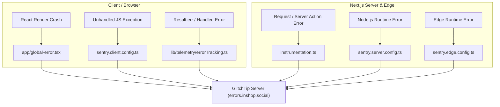

# GlitchTip Error Tracking Guide (Next.js 16 + React 19)

This guide documents how **GlitchTip** error tracking is integrated into the InShop application, how each component works, and how to capture errors in your code.

---

## 1. Architecture Overview

GlitchTip is 100% compatible with the **Sentry SDK** (`@sentry/nextjs`). Errors from the client (browser) and server (Node.js/Edge) are automatically collected and sent over HTTPS to the GlitchTip server using your project's DSN.



---

## 2. Integrated Files & Purpose

| File | Purpose |
| :--- | :--- |
| [`env.ts`](../env.ts) | Adds `NEXT_PUBLIC_GLITCHTIP_DSN` and `GLITCHTIP_DSN` to the type-safe environment schema. |
| [`.env`](../.env) | Stores your GlitchTip DSN (`https://c39862cad26a45aaa1f72b6e9e8c50dc@errors.inshop.social/5`). |
| [`sentry.client.config.ts`](../sentry.client.config.ts) | Initializes Sentry in the user's browser for client-side crash tracking. |
| [`sentry.server.config.ts`](../sentry.server.config.ts) | Initializes Sentry for Node.js server runtime error tracking. |
| [`sentry.edge.config.ts`](../sentry.edge.config.ts) | Initializes Sentry for Edge runtime (middleware and edge functions). |
| [`instrumentation.ts`](../instrumentation.ts) | Next.js App Router hooks (`register` and `onRequestError`) for catching server request failures. |
| [`app/global-error.tsx`](../app/global-error.tsx) | Root React error boundary that captures UI crashes to GlitchTip and renders a retry screen. |
| [`lib/telemetry/errorTracking.ts`](../lib/telemetry/errorTracking.ts) | Telemetry helper functions to report errors manually or attach user data. |
| [`app/dev/sentry-test/page.tsx`](../app/dev/sentry-test/page.tsx) | Interactive test page for testing GlitchTip error ingestion. |
| [`next.config.ts`](../next.config.ts) | Wrapped with `withSentryConfig` for bundle instrumentation and source map support. |

---

---

## 3. Google-Grade Structured Logging & Error Tracking

We have upgraded the telemetry architecture to an enterprise structured logging standard (similar to Google Cloud / OpenTelemetry).

### 3.1. Why Structured Logging Matters
- **No `[object Object]`**: Any error, object, or `Result.err` is automatically normalized with clean title, error code, and extracted details.
- **Indexed Search Tags**: Every event is automatically indexed by `domain`, `action`, `error_code`, `status_code`, and `user_role`.
- **Breadcrumbs Tracing**: Milestones and warning steps are recorded leading up to an error for effortless reproduction.
- **Intelligent Grouping**: GlitchTip groups identical errors by domain + action + code.

---

### 3.2. Structured Logger (`@/lib/telemetry/logger`)

Use `logger.forDomain(domain)` to log structured milestones, warnings, and errors for specific features:

```tsx
import { logger } from "@/lib/telemetry/logger";

// Create a scoped domain logger (auth, upload, feed, posts, checkout, profile, ui, system)
const authLogger = logger.forDomain("auth");

// 1. Record an informational step (Saved as Breadcrumb)
authLogger.info("User requested OTP code", { phone: "09120000000" });

// 2. Record a warning
authLogger.warn("OTP rate limit approaching", { attempt: 3 });

// 3. Record a structured error (Automatically dispatched to GlitchTip)
authLogger.error({
  code: "AUTH_EXPIRED_OTP",
  message: "کد تأیید منقضی شده است",
  action: "verify_otp",
  statusCode: 400,
  extra: { phone: "09120000000" },
});
```

---

### 3.3. Result Pattern Error Tracking (`@/lib/telemetry/errorTracking`)

InShop uses the mandatory `Result` pattern. To log a failed `Result.err`:

```tsx
import { captureResultError } from "@/lib/telemetry/errorTracking";

const result = await reserveStock(cartId);

// If result is an error, GlitchTip captures it with domain, action, and code tags:
captureResultError(result, {
  domain: "checkout",
  action: "reserve_inventory",
  code: "OUT_OF_STOCK",
  extra: { cartId },
});
```

---

---

### 3.4. Log Level Hierarchy & Critical Error Tagging

The telemetry system defines 5 standard log levels:

| Level | Method | Tagged Severity | When to Use |
| :--- | :--- | :--- | :--- |
| **`debug`** | `logger.debug()` | `debug` | Verbose diagnostic logs (only printed in development). |
| **`info`** | `logger.info()` | `info` | Normal milestones; automatically saved as Breadcrumbs leading up to errors. |
| **`warn`** | `logger.warn()` | `warning` | Recoverable warnings, latency spikes, or retry triggers. |
| **`error`** | `logger.error()` | `error` | Standard operational or API errors. |
| **`fatal`** / **`critical`** | `logger.fatal()` or `logger.critical()` | `critical` (`is_critical: true`) | **App-breaking failures** that make the app unusable (e.g. database down, payment crash, React root crash). |

#### Example of Logging a Critical App-Breaking Issue:
```tsx
import { logger } from "@/lib/telemetry/logger";

const sysLogger = logger.forDomain("system");

// Dispatches a highest-priority event with title '🚨 [CRITICAL][SYSTEM] ...'
sysLogger.fatal(new Error("Main database cluster unreachable"), {
  action: "database_connect",
  code: "DB_CLUSTER_DOWN",
  statusCode: 503,
});
```

---

### 3.5. Filtering in GlitchTip Dashboard

Because logs are structured with indexed tags, you can filter directly in GlitchTip:

| Query in GlitchTip | What It Finds |
| :--- | :--- |
| `is_critical:true` | **Only app-breaking, critical issues** |
| `level:fatal` | Highest severity fatal crashes |
| `domain:auth` | All authentication issues |
| `domain:upload action:chunk_upload` | All video/image chunk upload failures |
| `error_code:AUTH_EXPIRED_OTP` | All expired OTP errors |
| `status_code:504` | All gateway timeout errors |
| `user_role:seller` | Errors experienced by sellers |
| `environment:production` | Production-only errors |


---

## 4. How to Test Locally

1. Ensure `.env` has your DSN configured:
   ```env
   NEXT_PUBLIC_GLITCHTIP_DSN=https://c39862cad26a45aaa1f72b6e9e8c50dc@errors.inshop.social/5
   ```
2. You can test error capturing anywhere in your components or services:
   ```tsx
   import { logger } from "@/lib/telemetry/logger";

   logger.forDomain("system").error(new Error("Test error for GlitchTip verification"), {
     action: "test_verification",
   });
   ```
3. Check your GlitchTip project **Issues** dashboard at [https://errors.inshop.social](https://errors.inshop.social).

---

## 5. Setting Up Project Alerts in GlitchTip

1. Open [https://errors.inshop.social](https://errors.inshop.social) in your browser.
2. Select your project -> Click **Settings** (gear icon) -> Click **Alerts**.
3. Click **Create New Alert**.
4. Configure trigger rules (e.g. "An issue is first seen") and add recipients (Team email or Webhook URL).
5. Click **Save**.

---

---

## 6. Gitea Actions CI/CD: Automated Source Maps for Develop & Production

When code is built in production or staging, Next.js minifies and bundles JavaScript. To ensure GlitchTip can display **readable TypeScript file names and line numbers** for every build, the Gitea Runner automatically:
1. Injects unique **Debug IDs** into the build output.
2. Uploads the source maps to GlitchTip under the specific **Release Name** (`prod-${GITHUB_SHA}` or `develop-${GITHUB_SHA}`).
3. Tags errors by **Environment** (`production` vs `develop`).

---

### 6.1. Environment & Branch Separation

| Setting | Develop Environment | Production Environment |
| :--- | :--- | :--- |
| **Git Branch** | `develop` | `master` / `main` |
| **Release Name** | `develop-${GITHUB_SHA}` | `prod-${GITHUB_SHA}` |
| **Environment Tag** | `develop` | `production` |
| **Docker Image Tag** | `${IMAGE}:develop-${GITHUB_SHA}` | `${IMAGE}:${GITHUB_SHA}` |
| **Swarm Service** | `develop_application_frontend` | `application_frontend` |
| **GlitchTip DSN** | Develop Project DSN | Production Project DSN |

---

### 6.2. Required Gitea Secrets & Variables

In Gitea, go to **Repository Settings -> Actions -> Secrets & Variables**:

#### Secrets:
- `GLITCHTIP_AUTH_TOKEN`: API Auth token from GlitchTip (**User Settings -> Auth Tokens -> Create Token** with `project:releases` scope).

#### Variables:
- `GLITCHTIP_URL`: `https://errors.inshop.social`
- `GLITCHTIP_ORG`: Your GlitchTip organization slug (e.g. `inshop`).
- `GLITCHTIP_PROJECT`: Your GlitchTip project slug (e.g. `inshop-app` or project name).
- `NEXT_PUBLIC_GLITCHTIP_DSN_PROD`: `https://c39862cad26a45aaa1f72b6e9e8c50dc@errors.inshop.social/5`
- `NEXT_PUBLIC_GLITCHTIP_DSN_DEV`: (Optional: your separate develop project DSN if using one, or same DSN with develop tag).

---

### 6.3. Gitea Actions Workflow Integration (`.gitea/workflows/deploy.yml`)

Here is how the Gitea Actions workflow distinguishes between `develop` and `master`:

```yaml
name: frontend-ci-cd

on:
  push:
    branches:
      - master
      - main
      - develop
  workflow_dispatch: {}

jobs:
  build-test-push:
    runs-on: docker
    steps:
      - name: Checkout Code
        uses: actions/checkout@v4

      - name: Determine Environment & Release Name
        id: env_info
        run: |
          if [ "${{ github.ref }}" = "refs/heads/master" ] || [ "${{ github.ref }}" = "refs/heads/main" ]; then
            echo "env_name=production" >> "$GITHUB_OUTPUT"
            echo "release_name=prod-${{ github.sha }}" >> "$GITHUB_OUTPUT"
            echo "glitchtip_dsn=${{ vars.NEXT_PUBLIC_GLITCHTIP_DSN_PROD || vars.NEXT_PUBLIC_GLITCHTIP_DSN }}" >> "$GITHUB_OUTPUT"
          else
            echo "env_name=develop" >> "$GITHUB_OUTPUT"
            echo "release_name=develop-${{ github.sha }}" >> "$GITHUB_OUTPUT"
            echo "glitchtip_dsn=${{ vars.NEXT_PUBLIC_GLITCHTIP_DSN_DEV || vars.NEXT_PUBLIC_GLITCHTIP_DSN }}" >> "$GITHUB_OUTPUT"
          fi

      - name: Build Next.js Application
        env:
          NEXT_PUBLIC_GLITCHTIP_DSN: "${{ steps.env_info.outputs.glitchtip_dsn }}"
          SENTRY_RELEASE: "${{ steps.env_info.outputs.release_name }}"
          SENTRY_ENVIRONMENT: "${{ steps.env_info.outputs.env_name }}"
        run: |
          npm ci --legacy-peer-deps
          npm run build

      - name: Upload Source Maps to GlitchTip
        if: ${{ env.GLITCHTIP_AUTH_TOKEN != '' }}
        env:
          GLITCHTIP_AUTH_TOKEN: "${{ secrets.GLITCHTIP_AUTH_TOKEN }}"
        run: |
          echo "Injecting Debug IDs..."
          npx glitchtip-cli sourcemaps inject .next

          echo "Uploading Source Maps for release ${{ steps.env_info.outputs.release_name }}..."
          npx glitchtip-cli sourcemaps upload .next \
            --url "${{ vars.GLITCHTIP_URL || 'https://errors.inshop.social' }}" \
            --org "${{ vars.GLITCHTIP_ORG || 'inshop' }}" \
            --project "${{ vars.GLITCHTIP_PROJECT || 'inshop-app' }}" \
            --release "${{ steps.env_info.outputs.release_name }}" \
            --auth-token "${{ secrets.GLITCHTIP_AUTH_TOKEN }}"

          echo "Source maps successfully uploaded to GlitchTip!"
```

---

### 6.4. How It Works in GlitchTip

1. When you push to **`develop`**:
   - Gitea builds the image and uploads source maps labeled `develop-<commit_sha>`.
   - Errors from staging are tagged with `environment: develop` and `release: develop-<commit_sha>`.
2. When you push to **`master`**:
   - Gitea builds the production image and uploads source maps labeled `prod-<commit_sha>`.
   - Errors from production are tagged with `environment: production` and `release: prod-<commit_sha>`.
3. In GlitchTip:
   - You can filter issues by Environment (`production` vs `develop`) from the dropdown at the top of the Issues page.
   - When viewing an issue, GlitchTip matches the release tag, unminifies the stack trace, and highlights the exact TypeScript code line where the error occurred.

---

### 6.5. Security Hardening: Keeping Source Maps Private

To ensure **attackers and public users cannot view your TypeScript source code**:
- Source maps are uploaded **privately and directly** to your self-hosted GlitchTip server during the CI/CD build step.
- The production Docker runtime image executes `RUN find ./.next -name "*.map" -type f -delete` before running.
- **Result**: Zero `.map` files exist in the production web server. Browser DevTools will get `404 Not Found` if attempting to fetch `.map` files, while GlitchTip retains 100% readable source traces securely in your private dashboard.


