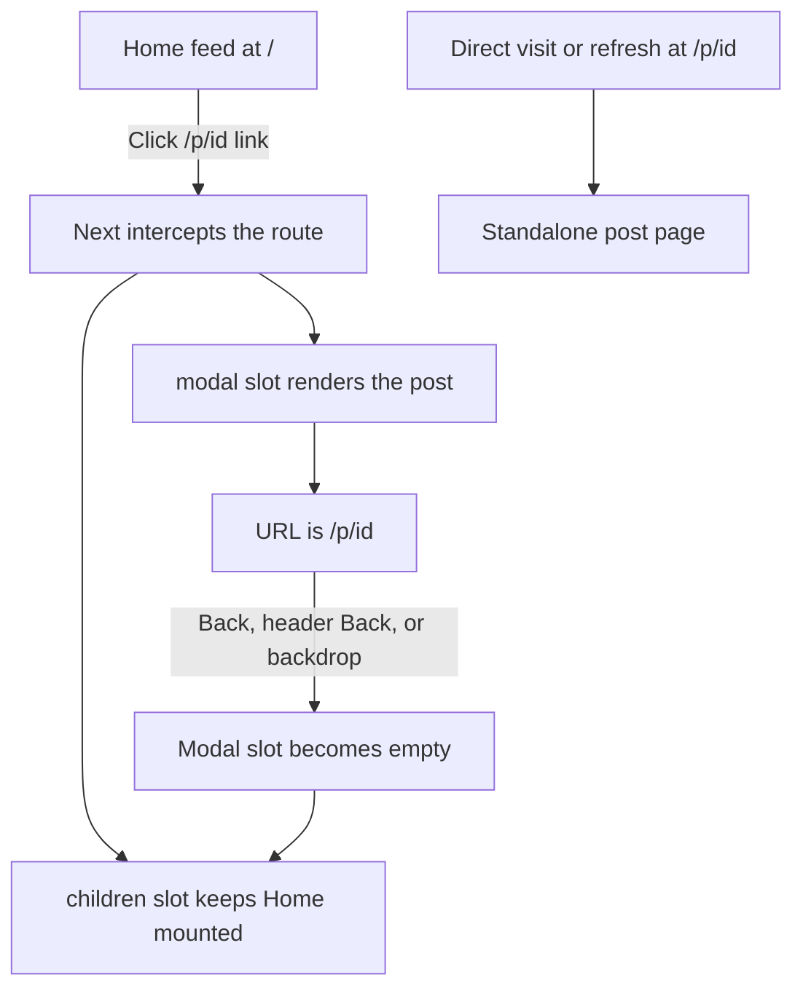

# Home feed to post navigation

This guide explains how opening a post from Home works, why the feed stays where it was, and how the same post page works when opened directly.

## The behavior

When someone opens a post from the Home feed, the browser URL changes to `/p/{id}` and the post appears over Home. The Home page remains mounted underneath. Browser Back, the post header’s Back button, or clicking the dark backdrop returns to Home with its existing scroll position and loaded feed pages.

Opening `/p/{id}` directly, refreshing that URL, or opening it in a new tab shows the regular standalone post page. There is no Home page behind it because a full page load has no previous in-app route state to preserve.

## Route map

The `(home)` folder is a Next.js route group. Parentheses organize routes without adding a segment to the URL, so `app/(home)/page.tsx` still serves `/`.

```text
app/
├── layout.tsx                         Root layout and shared providers
├── (home)/
│   ├── layout.tsx                     Renders Home and its modal slot together
│   ├── page.tsx                        The / route and feed
│   └── @modal/
│       ├── default.tsx                 Fallback when no modal is active
│       ├── page.tsx                    Empty modal slot at /
│       └── (.)p/[id]/page.tsx          Intercepts /p/{id} from Home
└── p/[id]/page.tsx                     Standalone /p/{id} route
```

`@modal` is a parallel route slot. It is passed to `(home)/layout.tsx` as the `modal` prop, alongside the ordinary `children` route. `(.)p` is an intercepting route: `.` means that `p` is at the same route level. A slot name does not count as a URL segment when Next.js resolves this convention.

The modal slot is inside the `(home)` group deliberately. That scopes interception to Home. A post link on another page still navigates to the standalone `/p/{id}` route.

## What happens when a feed tile is clicked

1. `ProfileGridItem` renders each tile as a Next.js link whose destination is `/p/{id}`.
2. Because this is a client-side navigation from Home, Next.js matches `app/(home)/@modal/(.)p/[id]/page.tsx`.
3. Next.js keeps the current Home route in the `children` slot and fills the `modal` slot with the intercepted post route.
4. The intercepted route renders `InterceptedPostDialog` around `PublicPostPageContent`.
5. `InterceptedPostDialog` uses the project’s `Dialog` component to portal a full-height post surface and backdrop over Home.
6. The URL is `/p/{id}`, so the current post can be copied or bookmarked while it is open.



## How the pieces are divided

### Home route and layout

`app/(home)/page.tsx` renders the feed and footer. `app/(home)/layout.tsx` renders both `children` and `modal`; it does not decide which is active. Next.js chooses the active route for each slot.

`app/layout.tsx` remains the application root. It provides shared context, including React Query, around both the route and slot content.

### Intercepted route

`app/(home)/@modal/(.)p/[id]/page.tsx` reads the dynamic `id` from Next.js route params. It composes the dialog shell with the shared post page content. This file is a route entry point, so it uses the required default export.

`app/(home)/@modal/default.tsx` returns `null` when a hard load cannot recover an active slot state. `app/(home)/@modal/page.tsx` returns `null` when the current Home URL is `/` and no post is open. These are Next.js route conventions, not the post UI itself.

### Full-screen dialog shell

`features/posts/public/InterceptedPostDialog.tsx` owns the overlay behavior. It uses the existing `Dialog` root, portal, and backdrop. Its close action calls `router.back()`, which reverses the navigation that opened the post.

The `fullscreen` variant in `components/ui/Dialog.tsx` fills the visible app viewport between `--app-offset-top` and `--app-offset-bottom`. Those CSS variables are maintained by `IosViewportFixer` so the surface fits the usable screen when mobile browser controls or the keyboard change the visible viewport. The `drawer` variant is intended for bottom sheets and animates from the bottom; the full-screen post uses a separate variant to avoid that sheet behavior.

The dialog portal is rendered under `document.body`, but React portals preserve the React context from their source tree. The post still sees the application’s query client and other providers.

### Shared post content and data

Both route entries use `features/posts/public/PublicPostPageContent.tsx`. It fetches the post on the server with `fetchPublicPostServer`, handles the result through the project’s `Result` type, and passes the result to `PublicPostView`.

`features/posts/public/PublicPostView.tsx` is the shared client UI. It supplies the post data to the post components, records the open event, and renders the post header, media, body, and footer. Keeping one view avoids having a separate modal implementation drift from the standalone page.

The standalone route, `app/p/[id]/page.tsx`, also owns the post’s metadata. Its metadata generation is separate from rendering the shared page content.

## Why the feed keeps its position

The feed scrolls inside the `<main id="home-grid-container">` element in `features/feed/components/Feed.tsx`. Browser `window.scrollY` is not the feed’s scroll position.

With this routing setup, opening the post does not replace or remount Home. Next.js leaves the Home `children` slot active and renders the post in a sibling slot. The feed’s scroll container therefore remains in the DOM at the same `scrollTop`; no saved post ID, `sessionStorage` snapshot, layout effect, or scroll restoration code is needed.

The feed data has a separate cache. `useInfiniteFeedPosts` in `features/feed/services/feedService.ts` uses a TanStack Query infinite query, with the key `['posts', 'feed', 'infinite', limit]`. Its pages live in the root React Query client. Since Home remains mounted, returning from the overlay neither recreates the query nor requests the initial feed page again. The query also sets a ten-minute stale time, a one-hour garbage collection time, and `refetchOnMount: false`.

The route pattern preserves the feed’s live component state and the query cache. It does not make feed data permanent: a reload, a new tab, or an expired cache follows the normal loading and fetching rules.

## Closing and leaving the overlay

- **Browser Back / Forward:** the intercepted route is a real history entry. Back closes it; Forward can reopen it while that client route state is available.
- **Post header Back:** `Header.Back` uses the app’s safe-back helper. For an in-app post navigation, it returns to the previous route.
- **Backdrop:** the dialog’s backdrop calls its close callback, which calls `router.back()`.
- **Navigate to a different section:** leaving the `(home)` route group removes its modal slot. The destination page renders normally.
- **Direct visit or refresh:** Next.js has no intercepted Home state to use, so `app/p/[id]/page.tsx` renders the standalone page.

## Scope and limitations

Interception applies only to client-side navigation to `/p/{id}` while the `(home)` route group is active. A profile, search, or seller page outside this group opens the standalone post route. A copied URL opened in another tab also opens the standalone page.

Keeping Home mounted preserves its DOM, query observers, and loaded media while the post is open. That uses more memory than replacing Home with the post page. This cost lasts only while the intercepted route remains active; leaving the Home route group unmounts it.

The dialog is a full-height overlay, not a second browser window. On wide screens it follows the app’s `--container-app` width, while the backdrop covers the rest of the viewport.

The `@modal/default.tsx` and `@modal/page.tsx` files are important. If the Home route or slot structure changes, keep a matching empty route for the no-modal state. If more routes are added inside `(home)`, decide whether their modal slot should remain active or have an explicit empty match.

## How to change this later

To change the overlay’s viewport fit or stacking, edit the `fullscreen` branch in `components/ui/Dialog.tsx` and the backdrop/content composition in `InterceptedPostDialog.tsx`. Keep the app offset variables: they account for the visible iOS viewport.

To change the post UI, edit `PublicPostView.tsx`; both standalone and intercepted views use it. To change post loading, edit `PublicPostPageContent.tsx` or the canonical server service. To change which pages use interception, move or add the parallel slot under the route group that should own that behavior.

After moving any route files, check the Next.js App Router docs in `node_modules/next/dist/docs/` and run the project type check and production build. Route folder names such as `@modal`, `(home)`, and `(.)p` carry routing meaning, so moving them changes behavior even when the URL does not change.
