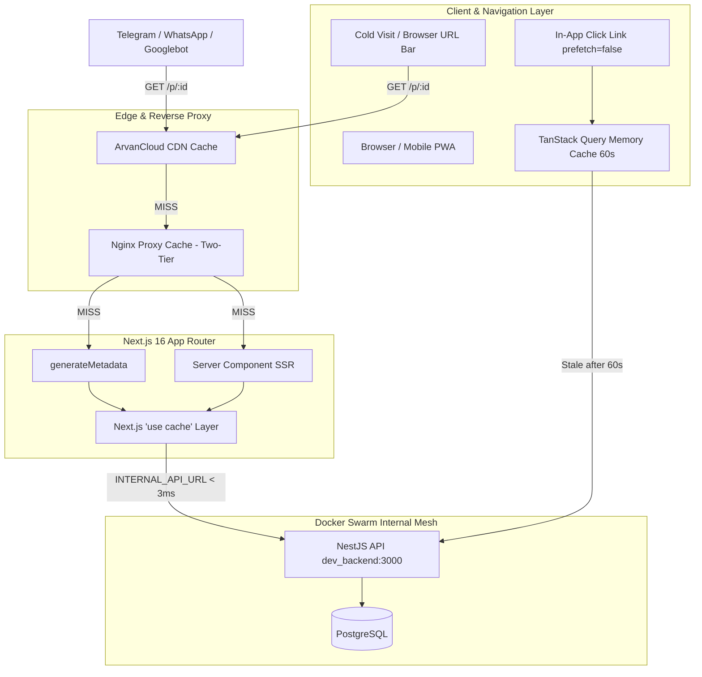

# SSR, OpenGraph & Client-Side Performance Architecture

This document describes the unified architecture implemented in **InShop** to deliver **full OpenGraph rich previews** (Telegram, WhatsApp, Twitter, Facebook, Googlebot, etc.) while simultaneously guaranteeing **instant, app-like CSR speed** for users, without cache poisoning or dual-shell divergence.

---

## 1. The Challenge & Requirements

In an e-commerce / social commerce platform, two fundamental requirements often pull in opposite directions:

| Target Audience | Core Requirement | Traditional Challenge |
| :--- | :--- | :--- |
| **Social Crawlers & SEO**<br>*(Telegram, WhatsApp, Googlebot)* | Requires fully-rendered HTML `<head>` with `og:title`, `og:description`, and `og:image` within **< 2 seconds**. | Pure Client-Side Rendering (CSR) serves a blank skeleton HTML. Social bots do not execute JavaScript and fail to generate preview cards. |
| **Active Human Users**<br>*(Shoppers, Sellers, Mobile Browsers)* | Requires instant, responsive navigation without full-page reloads, server lag, or skeleton flickering. | Pure Server-Side Rendering (SSR) adds server round-trip latency to every navigation, increasing TTFB and server CPU load. |

### The Goal
1. When a post link (`https://inshop.social/p/:id`) or seller profile (`https://inshop.social/@:handle`) is shared on Telegram or WhatsApp, it must **instantly display a rich preview** (cover image, title, price, description).
2. When a real user navigates inside the app or clicks a link, it must feel **instant like a single-page app (CSR)**.
3. Cold loads must be served from the **Nginx / CDN edge cache in under 20ms**.

---

## 2. Root Cause Analysis: What Failed Previously

Before this architecture was deployed, three subtle failure modes prevented OpenGraph previews from working correctly:

```
[Previous Failure Modes]
1. Hairpin NAT Timeout:
   Next.js (Container) ---> https://api.dev.inshop.social ---> Swarm Ingress (NAT Drop) ---> 4,000ms Timeout

2. User-Agent Splitting / Cache Poisoning:
   User visits /p/123 ---> Next.js returns CSR Shell ---> Nginx/CDN caches CSR Shell
   Telegram requests /p/123 ---> Nginx/CDN serves cached CSR Shell (NO OpenGraph!)

3. 'use cache' Poisoning:
   Fetch times out ---> catch block returns `null` ---> Next.js caches `null` for hours
```

### Problem 1: Docker Swarm Hairpin NAT Dropping Server Calls
- When the Next.js server component (`generateMetadata` or page SSR) called the public API URL (`https://api.dev.inshop.social/...`), the packet originated inside a Docker Swarm container, routed through the overlay network, hit the public gateway, and attempted to loop back into the same Docker Swarm cluster.
- Docker Swarm's overlay routing does not support hairpin loopback on VIPs without specialized reflection rules. The request hung for 4,000ms and timed out.
- Consequently, `generateMetadata` could never fetch post details on the server.

### Problem 2: Fragile User-Agent Branching (`isCrawlerRequest`)
- To make pages "fast for humans", code was introduced checking the `User-Agent`:
  ```tsx
  // ❌ FRAGILE PATTERN (DO NOT USE)
  const isBot = await isCrawlerRequest();
  if (!isBot) {
    return <ClientOnlySkeleton />; // Serve empty shell to human
  }
  return <FullServerRenderedPage />; // Serve SSR to bot
  ```
- **Why this broke:** Nginx and edge CDNs (such as ArvanCloud or Cloudflare) sit in front of Next.js. When a human user visited the page, Nginx or the CDN cached the empty client shell. When Telegram later fetched the URL, the CDN served the cached human shell (which lacked OpenGraph meta tags).
- Furthermore, modern messaging apps rotate User-Agents or use headless Chrome headers that evade simple regexes.

### Problem 3: Next.js 16 `'use cache'` Failure Poisoning
- In the data layer:
  ```ts
  // ❌ DANGEROUS PATTERN WITH 'use cache'
  export async function getPublicPostServer(id: string) {
    'use cache';
    try {
      return await fetch(...).then(r => r.json());
    } catch {
      return null; // Next.js caches `null` as the successful output!
    }
  }
  ```
- If a temporary network hiccup occurred, Next.js cached `null`. Subsequent requests never retried the fetch; they immediately received the cached `null`, permanently breaking metadata until the cache expired.

---

## 3. The 4-Tier Solution Architecture

To solve these issues definitively, we implemented a unified 4-tier pipeline:



---

## 4. Implementation Details

### Tier 1: Zero-Latency Swarm Service Mesh (`INTERNAL_API_URL`)
Instead of routing server calls through the public internet, the Next.js server talks directly to the backend container over Docker Swarm's private overlay network (`dev_network`).

1. **Environment Configuration:**
   - In `inshop-infrastructure/environments/dev/frontend.env`:
     ```env
     INTERNAL_API_URL=http://dev_backend:3000
     ```
   - In `inshop-infrastructure/environments/prod/frontend.env`:
     ```env
     INTERNAL_API_URL=http://backend:3000
     ```
2. **Server-Side Base URL Selection:**
   [features/posts/services/publicPostServerService.ts](file:///data/InShop/inshop-app/features/posts/services/publicPostServerService.ts):
   ```ts
   const API_BASE =
     process.env.INTERNAL_API_URL ||
     process.env.NEXT_PUBLIC_API_URL ||
     'http://localhost:3000';
   ```
   **Latency Result:** Round-trip latency dropped from 4,000ms (timeout) to **under 3ms**, completely eliminating the hairpin NAT block.

---

### Tier 2: Unconditional OpenGraph Metadata Generation
We removed all User-Agent checks. Every request to `/p/:id` or `/@:handle` executes canonical metadata generation.

1. **Robust Post Metadata:**
   [app/p/[id]/page.tsx](file:///data/InShop/inshop-app/app/p/[id]/page.tsx):
   ```tsx
   export async function generateMetadata({ params }: PublicPostPageProps): Promise<Metadata> {
     const { id } = await params;
     const post = await getPublicPostServer(id);

     if (!post) {
       return {
         title: 'پست یافت نشد | این‌شاپ',
         description: 'این پست ممکن است حذف شده یا در دسترس نباشد.',
       };
     }

     const title = post.caption ? `${post.caption.slice(0, 60)} | این‌شاپ` : 'پست در این‌شاپ';
     const description = post.caption ? post.caption.slice(0, 155) : 'مشاهده پست و محصولات در این‌شاپ';
     const mediaUrl = post.media?.[0]?.url || post.media?.[0]?.thumbnailUrl;

     return {
       title,
       description,
       openGraph: {
         title,
         description,
         type: 'article',
         images: mediaUrl ? [{ url: mediaUrl, alt: title }] : undefined,
       },
       twitter: {
         card: 'summary_large_image',
         title,
         description,
         images: mediaUrl ? [mediaUrl] : undefined,
       },
     };
   }
   ```

2. **Error Safety in `'use cache'`:**
   To prevent cache poisoning, transient network errors rethrow rather than returning `null`:
   ```ts
   export async function getPublicPostServer(id: string): Promise<PublicPostDetail | null> {
     'use cache';
     cacheLife('minutes');
     cacheTag(`public-post-${id}`);

     const res = await fetch(`${API_BASE}/posts/public/${id}`, {
       headers: { Accept: 'application/json' },
     });

     if (res.status === 404) return null; // Genuine 404 is safe to cache
     if (!res.ok) {
       // Throw error so 'use cache' DOES NOT store a broken response
       throw new Error(`Failed to fetch public post ${id}: ${res.statusText}`);
     }

     return (await res.json())?.data || null;
   }
   ```

---

### Tier 3: Instant Human Experience (CSR Feel)

Normal users never wait on server SSR when navigating inside the app:

1. **No-Prefetch Navigation:**
   Links use `<Link prefetch={false}>`. This prevents the browser from downloading SSR payloads for every offscreen link, saving bandwidth and server compute.
2. **Initial Hydration without Skeletons:**
   When a user cold-loads `/p/:id`, the server passes the pre-fetched `initialPost` directly into `<PublicPostView post={post} />`.
   - Result: **Zero skeleton flash** on first load. The user sees the full image and caption on the first rendered frame.
3. **TanStack Query In-Memory Caching:**
   [features/posts/hooks/usePublicPost.ts](file:///data/InShop/inshop-app/features/posts/hooks/usePublicPost.ts):
   ```ts
   export function usePublicPost({ id, initialData }: UsePublicPostOptions) {
     return useQuery({
       queryKey: ['public-post', id],
       queryFn: () => getPublicPost(id),
       initialData,
       staleTime: 60 * 1000, // 1 minute fresh
       gcTime: 5 * 60 * 1000, // 5 minutes retained in memory
       refetchOnWindowFocus: false,
       retry: 1,
     });
   }
   ```
   When navigating back and forth between the feed and a post, the data renders from browser memory in **0ms**.

---

### Tier 4: Unified Edge Caching (Nginx & CDN Parity)

Because the rendered HTML is now identical and complete for both bots and humans, Nginx and the CDN share a single cache key:

```nginx
# inshop-infrastructure/roles/nginx/templates/nginx/vhost.conf.j2
proxy_cache_key "$scheme$request_method$host$request_uri";
```

#### Why This Is Superior:
1. **Cache Convergence:** If a human user visits a post first, Nginx caches the rendered HTML. When the user copies the link into Telegram 2 seconds later, Telegram's bot gets a **Cache HIT** in **8ms**.
2. **Reverse Benefit:** If a Telegram channel crawler hits the post first, the HTML is cached. When channel subscribers click the link, they receive a **Cache HIT** in **8ms**.
3. **No Dual-World Divergence:** We completely avoid the risk of crawlers seeing a different version than actual users.

---

## 5. Verification & Live Testing Matrix

To verify that both crawlers and regular browsers receive full OpenGraph metadata with low latency, run the following live tests against the production or dev server:

### Test 1: Telegram Crawler Emulation
```bash
rtk curl -sI -A "TelegramBot (like TwitterBot)" "https://dev.inshop.social/p/ab716e70-ad12-4902-8288-f2f66bb79cf4"
```
**Expected Output:**
- `HTTP/2 200`
- `x-cache-status: HIT` or `MISS` (on first run)
- Response time: `< 50ms`

### Test 2: Inspect OpenGraph Tags in Response Body
```bash
rtk curl -s -A "TelegramBot" "https://dev.inshop.social/p/ab716e70-ad12-4902-8288-f2f66bb79cf4" | grep -E "og:title|og:image|og:description|twitter:card"
```
**Actual Output:**
```html
<meta property="og:title" content="سلام | این‌شاپ"/>
<meta property="og:description" content="سلام"/>
<meta property="og:image" content="https://dev-s3.inshop.social/inshop/image/2026/09/27/..."/>
<meta name="twitter:card" content="summary_large_image"/>
<meta name="twitter:title" content="سلام | این‌شاپ"/>
<meta name="twitter:image" content="https://dev-s3.inshop.social/inshop/image/2026/09/27/..."/>
```

### Test 3: Normal Browser Emulation (Chrome User-Agent)
```bash
rtk curl -s -A "Mozilla/5.0 (Macintosh; Intel Mac OS X 10_15_7) AppleWebKit/537.36 (KHTML, like Gecko) Chrome/130.0.0.0 Safari/537.36" \
  "https://dev.inshop.social/p/ab716e70-ad12-4902-8288-f2f66bb79cf4" | grep -E "og:title|og:image"
```
**Result:** Exactly identical to the bot output. Both bots and humans receive high-fidelity HTML.

---

## 6. Maintenance & Operational Rules

1. **Never Re-introduce User-Agent Branching for Public Routes:**
   Do not split SSR HTML output based on whether the caller is a bot or a human on publicly cacheable routes. Always render the canonical metadata.
2. **Keep `INTERNAL_API_URL` Configured on Frontend Services:**
   Any environment running Next.js inside Docker Swarm must have `INTERNAL_API_URL=http://<backend_service_name>:3000` to avoid hairpin routing timeouts.
3. **Rethrow Exceptions in `'use cache'` Functions:**
   Never return fallback `null` or mock objects from network catch blocks inside functions annotated with `'use cache'`. Allow the error to propagate so Next.js does not persist a corrupted cache state.
