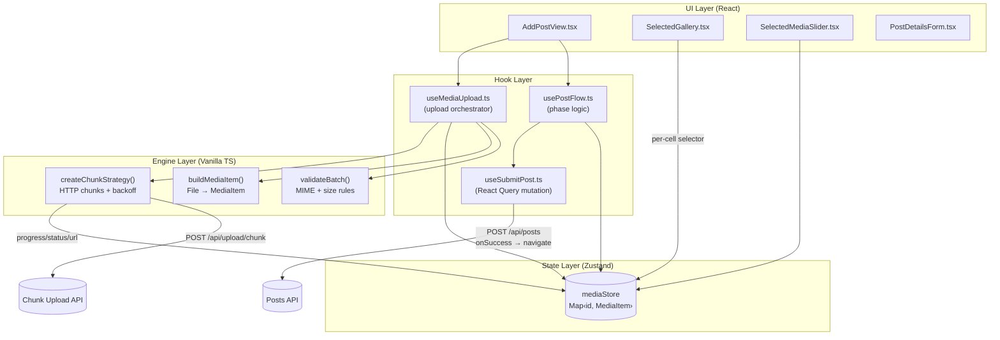
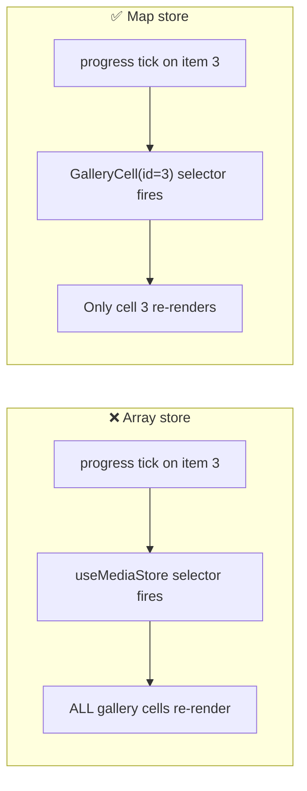
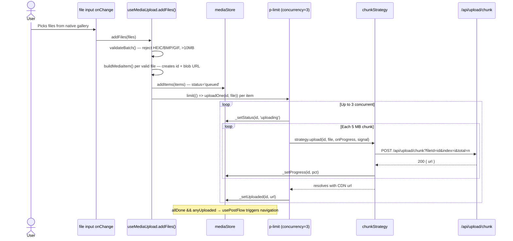
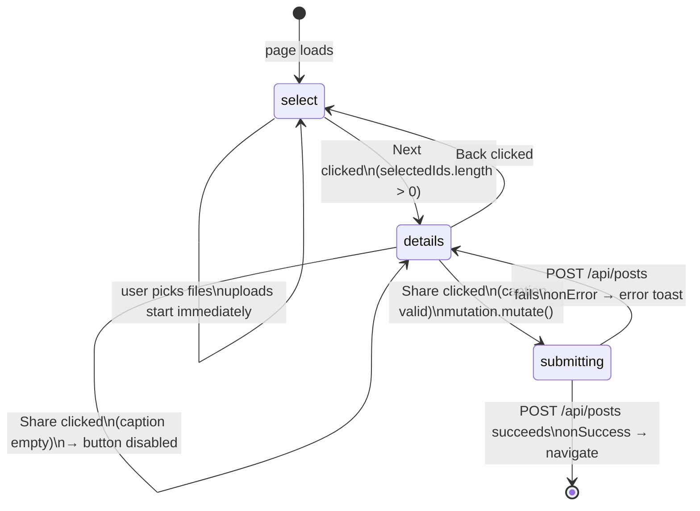

# Add New Post — Architecture

This document describes the current architecture of `features/posts/new`.  
**Last updated to reflect the p-limit concurrency design.**

---

## 1. The Three Layers



**Key rule:** The engine layer has zero React imports. `createChunkStrategy` is a module-level singleton in the hook — it never touches Zustand directly. The hook is the only place that wires chunk callbacks to store mutations.

---

## 2. Data Model

```typescript
// features/posts/new/types.ts

type MediaKind   = 'image' | 'video';
type MediaStatus = 'queued' | 'uploading' | 'uploaded' | 'failed' | 'cancelled';

interface MediaItem {
  id:          string;       // crypto.randomUUID()
  file:        File | null;  // nulled after upload completes (GC)
  localUrl:    string;       // blob URL — revoked in removeItem()
  status:      MediaStatus;
  progress:    number;       // 0–100, only meaningful when status = 'uploading'
  mediaKind:   MediaKind;
  uploadedUrl?: string;      // set by server on success
  error?:      string;
}
```

**Terminal statuses** — once an item reaches one of these, it never changes again:
`uploaded` | `failed` | `cancelled`

---

## 3. State Store — why `Map` instead of array



Each gallery cell subscribes only to its own slice:

```typescript
// SelectedGallery.tsx — GalleryCell
const item = useMediaStore((s) => s.itemMap.get(id));
```

With an array store, every progress tick (fired ~10× per second per uploading file) would re-render the entire gallery grid. With `Map<id, MediaItem>`, only the cell whose item changed re-renders.

**Store shape:**
```typescript
{
  itemMap:          Map<string, MediaItem>  // O(1) lookup
  selectedIds:      string[]                // ordered — index = badge number
  activePreviewIdx: number                  // which slide is shown in the slider
}
```

**Key store methods:**
| Method | What it does |
|---|---|
| `addItems(items)` | Appends to the Map — never replaces existing items |
| `removeItem(id)` | Revokes blob URL, deletes from Map, removes from selectedIds |
| `toggleSelected(id)` | Only works when `status === 'uploaded'` |
| `_setStatus(id, s)` | Auto-removes from selectedIds if new status ≠ `'uploaded'` |
| `_setProgress(id, p)` | Updates only the progress field (minimal re-render surface) |
| `_setUploaded(id, url)` | Sets uploadedUrl, status=uploaded, progress=100, file=null |

---

## 4. Upload Lifecycle



**Uploads start immediately when files are picked — there is no "start upload" button.**  
By the time the user fills in the caption, uploads are usually already complete.

---

## 5. Concurrency — `p-limit` + `AbortController`

The hook uses [`p-limit`](https://github.com/sindresorhus/p-limit) (560 B, zero deps) to cap concurrent uploads at 3. There is no manual queue or active-count bookkeeping.

```
addFiles([f1, f2, f3, f4, f5])
  └─ limit(() => uploadOne(f1))  ← starts immediately (slot 1)
  └─ limit(() => uploadOne(f2))  ← starts immediately (slot 2)
  └─ limit(() => uploadOne(f3))  ← starts immediately (slot 3)
  └─ limit(() => uploadOne(f4))  ← queued — no slot yet
  └─ limit(() => uploadOne(f5))  ← queued — no slot yet

f1 completes → p-limit starts f4
f2 completes → p-limit starts f5
```

**Cancel** is handled with one `AbortController` per item, stored in a `Map<id, AbortController>`:

```
cancelUpload(id)
  ├─ ctrl.abort()                    ← signals the fetch to stop
  ├─ _setStatus(id, 'cancelled')     ← immediate UI feedback
  └─ controllers.delete(id)

When the p-limit slot opens for a cancelled item:
  uploadOne sees no controller (or aborted signal) → returns early
```

**Unmount cleanup** (via `useEffect` return):
```
for each controller → ctrl.abort()
controllers.clear()
limit.clearQueue()   ← prevents queued tasks from starting after unmount
```

---

## 6. Chunk Strategy — retry logic

```
attempt 0 → fails with 503 → wait 1 s → retry
attempt 1 → fails with 503 → wait 2 s → retry
attempt 2 → fails with 503 → wait 4 s → retry
attempt 3 → give up → throw → hook marks item 'failed'
```

Retryable HTTP statuses: `0` (network error), `429` (rate limit), `5xx` (server error).  
Non-retryable: `4xx` (except 429) — the server rejected the request; retrying won't help.

The `fetcher` parameter is injected (defaults to `window.fetch`). In unit tests, a `jest.fn()` is passed instead so no real HTTP calls are made.

---

## 7. Phase Logic



**Navigation is imperative — it happens in the mutation's `onSuccess`.**  
There is no `useEffect` watching state. The Share button click is the only trigger.

```typescript
// useSubmitPost.ts
export function useSubmitPost(onSuccess: () => void) {
  return useMutation({
    mutationFn: submitPost,          // POST /api/posts
    onSuccess,                       // → onNavigate('pending-posts')
    onError: () => toast.error('...'),
  });
}

// usePostFlow.ts — handleNext() in the details phase
const mediaUrls = selectedIds
  .map((id) => itemMap.get(id)?.uploadedUrl)
  .filter((url): url is string => !!url);

submitPost.mutate({ caption, mediaUrls });
```

**Why not `useEffect`?**  
Effects run because a component was *displayed*. Navigation after Share is a direct consequence of a *user action* — it belongs in the event handler chain (`handleNext` → `mutate` → `onSuccess`), not in a side effect watching derived state.

---

## 8. Component Tree

```
AddPostView
├── <input type="file" accept="image/*" multiple className="hidden" />
│     accept="image/*" opens the native photo library on iOS / Android
├── AddPostHeader          id="add-post-back-btn"
│
├── [phase === 'select']
│   ├── SelectedMediaSlider    reads selectedIds + itemMap from store
│   └── SelectedGallery        reads itemMap.keys() from store
│       └── GalleryCell × N    each subscribes only to itemMap.get(id)
│           └── StatusOverlay  renders based on item.status
│               queued    → Clock icon
│               uploading → progress bar + percentage
│               uploaded  → nothing (transparent)
│               failed    → red overlay + retry button
│               cancelled → dark overlay + X
│
└── [phase === 'details']
    └── PostDetailsForm
        ├── SelectedMediaSlider (isCompact)
        └── Textarea  id="caption-textarea-input"
            label     htmlFor="caption-textarea-input" → "توضیحات محصول"

AddPostFooter
  select phase  → id="btn-next-step" + id="btn-trigger-picker"
  details phase → id="btn-share-post"
                  disabled when caption.trim() === '' OR mutation.isPending
                  shows Loader2 spinner while isPending
```

---

## 9. React constraints in this project

| Rule | Why |
|---|---|
| No `useCallback`, `useMemo`, `React.memo` | React Compiler handles all memoization automatically |
| No `forwardRef` | React 19 — pass `ref` as a normal prop |
| Factory functions, not singletons | Test isolation — each test creates its own store instance |

---

## 10. File map

```
app/
  layout.tsx                     ← Wraps children in <Providers>
  providers.tsx                  ← 'use client' QueryClientProvider (one client per session)

features/posts/new/
  types.ts                       ← MediaItem, MediaKind, MediaStatus
  constants.ts                   ← All Persian UI strings
  AddPostView.tsx                ← Main view (file input, phase render, footer)
  AddPostClientWrapper.tsx       ← Next.js client wrapper (router.back)
  components/
    AddPostHeader.tsx            ← Back button (id="add-post-back-btn")
    AddPostFooter.tsx            ← Next/Add/Share buttons + loading spinner
    SelectedMediaSlider.tsx      ← Preview slider for selected items
    SelectedGallery.tsx          ← Thumbnail grid + GalleryCell + StatusOverlay
    PostDetailsForm.tsx          ← Caption form + compact slider
  hooks/
    usePostFlow.ts               ← Phase state + handleNext/Back (no useEffect)
    useMediaUpload.ts            ← Orchestrator: validate → build → store → p-limit → upload
    useSubmitPost.ts             ← React Query mutation: POST /api/posts → onSuccess navigate
  services/
    validateBatch.ts             ← Returns { valid, rejected } — no throws
    buildMediaItem.ts            ← Pure factory: File → MediaItem (blob URL created here)
    chunkStrategy.ts             ← createChunkStrategy(): HTTP chunks, retry with backoff
    mediaStore.ts                ← createMediaStore() factory + useMediaStore singleton
  __tests__/
    validateBatch.test.ts
    chunkStrategy.test.ts
    mediaStore.test.ts
    AddPostView.test.tsx         ← Wraps in QueryClientProvider, MSW mocks /api/posts
```
